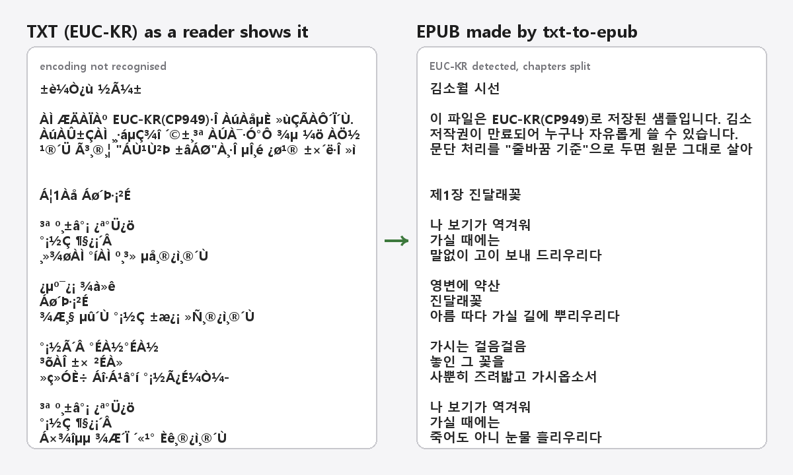

# Chaekgalpi Tools – TXT to EPUB

[한국어](README.md) · [中文](README.zh-CN.md) · [日本語](README.ja.md)

Turns a plain-text novel (.txt) into an EPUB you can read on a Ridipaper, Crema or Kindle. The encoding (EUC-KR, CP949, UTF-8, UTF-16) is detected automatically and chapters are split automatically. No server, no install, the original file is never touched.



## Download

- **Executable**: get `txt-to-epub.exe` from [Releases](https://github.com/microhan1/txt-to-epub/releases) and double-click it. Nothing to install. The file is unsigned, so if SmartScreen warns you, choose "More info → Run anyway".
- **Run from source**:

```bash
pip install -r requirements.txt
python main.py
```

## Usage

1. Drop TXT files onto the window. The encoding is detected and the beginning of the text is previewed. If it looks garbled, change the encoding right there.
2. Check the detected chapter list. Untick anything that is not a chapter; add missed ones by line number.
3. Set the title, author, text language, cover and style, then press **Convert**. `<name>.epub` is written next to the original.

The command line works too:

```bash
python main.py novel.txt --encoding auto --chapter-pattern "^Chapter \d+" --title "Title" --author "Author" --lang en --cover cover.jpg
```

`python main.py --help` shows the options in your OS language (한국어 · English · 中文 · 日本語). `--lang` is the language of the text (the EPUB's `dc:language`); the interface language is `--ui-lang`.

## Chapter pattern examples

A line is a chapter heading when the whole line matches the pattern. The default pattern catches all of these, and you can type your own regular expression. The patterns live in `patterns.json`.

| Language | Examples |
|---|---|
| Korean | `제1장 시작`, `12화` |
| English | `Chapter 7`, `CHAPTER XII. The Pool of Tears` |
| Chinese | `第3章`, `第十二回` |
| Japanese | `第3話 帰郷`, `プロローグ` |

## What it does not do

- No EPUB3, MOBI or AZW3. EPUB2 only.
- No spell checking or text editing.
- No merging of several TXT files into one EPUB.
- Documents with images (HTML, DOCX) are out of scope.
- No DRM removal and no web-novel scraping.

## Series

- Chaekgalpi Tools: [Scan PDF Cleanup (scan-pdf-cleanup)](https://github.com/microhan1/scan-pdf-cleanup) · [Margin crop (TrimPDF)](https://github.com/microhan1/TrimPDF) · [Two-page split (spread-split)](https://github.com/microhan1/spread-split) · [TOC bookmarks (pdf-toc-add)](https://github.com/microhan1/pdf-toc-add)
- [Chaekgalpi Library](https://chaekgalpi.co.kr/tools/txttoepub?utm_source=github&utm_medium=referral&utm_campaign=tool_cta&utm_content=txttoepub) — a web service for logging the books you read and writing reviews (Korean only)

## License

MIT. See [LICENSE](LICENSE).

The released exe also bundles third-party components such as Python and Tcl/Tk. They and their full license texts are listed in [THIRD_PARTY_LICENSES.txt](THIRD_PARTY_LICENSES.txt).
